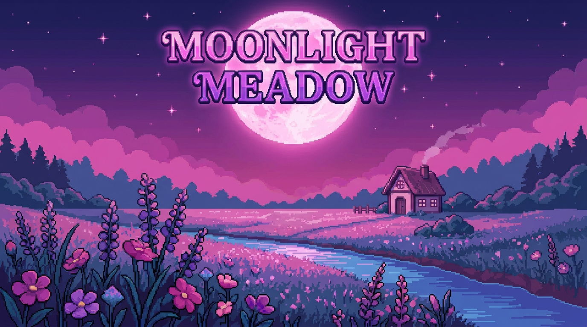

# 🌙 Moonlight Meadow

**A cozy farming RPG where magic and logic intertwine.**

---

## About

Moonlight Meadow is a 2D top-down RPG built in Unity. You play as a young witch who tends to a magical meadow, brews potions, completes quests for the locals, and uncovers the story of a world split between the mundane and the magical.

The twist: crafting isn't just about gathering ingredients. Every recipe is a **logic puzzle**, you must arrange the steps in the correct order, navigating `for` loops and `if/else` branches to brew the perfect potion.

## Features

- **Dual-world magic system**: the world shifts between its normal form and a magical overlay, changing how objects look and interact
- **Logic-based crafting**: recipes are structured like code: sequential steps, conditional branches, and loops that you drag and rearrange to solve
- **Farming**: plant and grow crops, including magical variants that only thrive under the right conditions
- **Story-driven progression**: a handcrafted story with cutscenes, NPC dialogue, and quest beats that advance the narrative day by day
- **Quest system**: accept and track quests with objectives, rewards, and progression gating tied to the story
- **NPCs & dialogue**: a cast of characters with their own voices, portraits, and evolving dialogue as the story unfolds
- **Day/night cycle**: dynamic lighting shifts the mood of the world across each in-game day
- **Save system**: your progress persists between sessions

## How to Play

1. **Download** the build from the link at the top of this page
2. Extract the `.zip` and run `MoonlightMeadow.exe`
3. No installation required

### Controls

| Action | Key |
|---|---|
| Move | `WASD` / Arrow keys |
| Interact | `Right Mouse Button` |
| Open Menu | `ESC` |
| Open recipe book | `C` |

## Built With

- **Unity** (2022): engine and rendering
- **C#**: all game logic
- **Unity 2D Pixel Perfect**: pixel-art rendering
- **TextMeshPro**: UI text

## Author

Made by **Adriana Tarrats Mejia** as a Bachelor's Thesis at Universitat de Barcelona.
